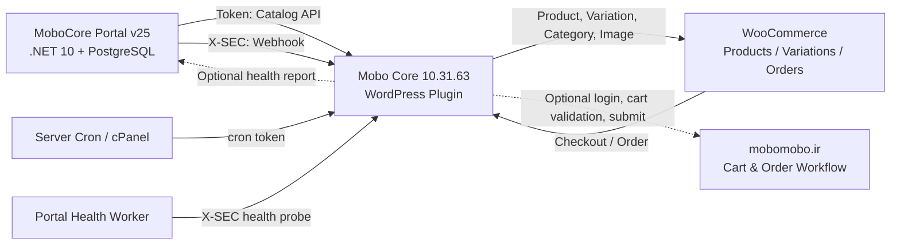
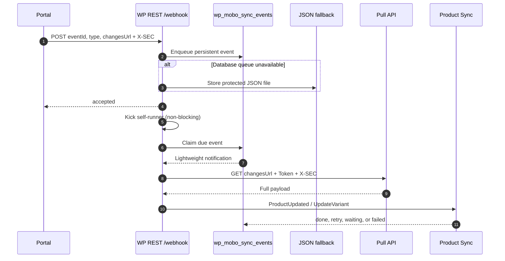
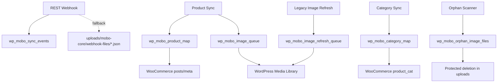
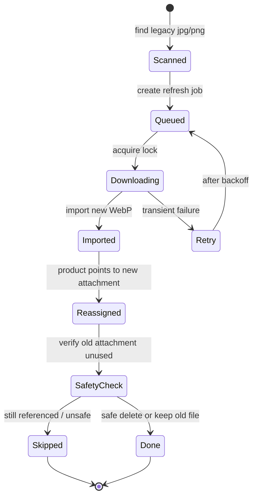
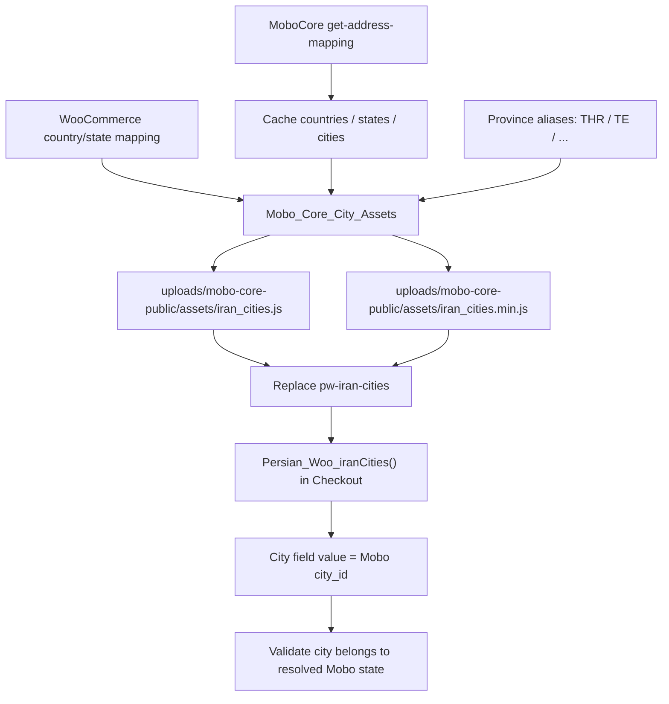
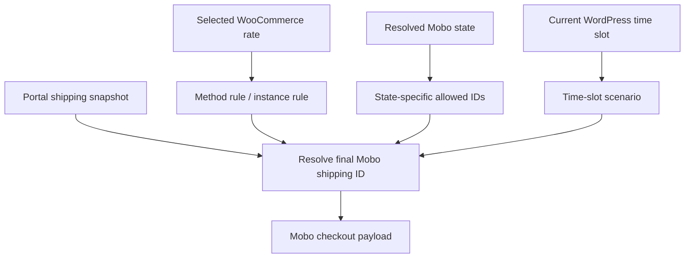
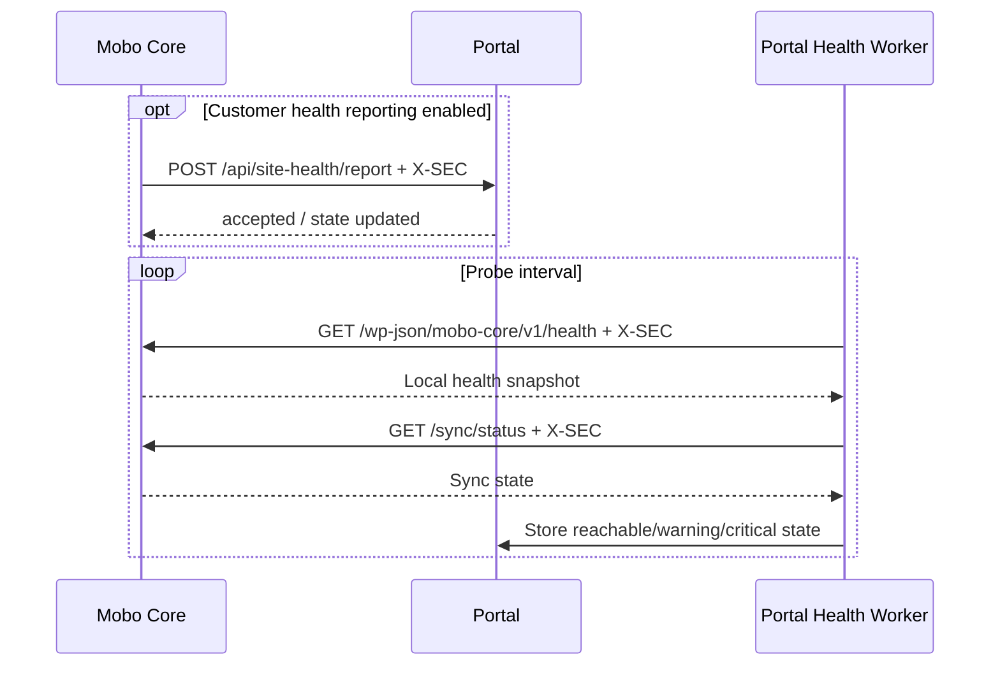

# Mobo Core — Architecture & Flow Diagrams / نمودارهای معماری و جریان

<div align="center">

**Mobo Core `10.31.63` · Portal `v25 / .NET 10`**

[فارسی](#fa) · [English](#en) · [راهنمای کامل](README_FULL.MD) · [مرجع توابع](FUNCTIONS.MD) · [نمودارها](DIAGRAMS.MD)

</div>

---

<a id="fa"></a>

# نمودارهای فارسی

تمام labelهای اصلی نمودارها دوزبانه هستند تا یک نمودار مشترک برای نسخه فارسی و انگلیسی باقی بماند. GitHub این فایل را با Mermaid رندر می کند.

## 1. معماری کلان



## 2. Sync کامل با Cursor

```mermaid
sequenceDiagram
    autonumber
    participant A as Admin/Cron
    participant WP as Mobo Core
    participant API as Portal API
    participant DB as WP Database
    participant WC as WooCommerce

    A->>WP: Start sync / شروع همگام سازی
    WP->>DB: Save syncId and cursor
    WP->>API: GET get-categories (Token)
    API-->>WP: Category payload
    WP->>WC: Upsert categories and map GUIDs
    loop Product cursor slices
        WP->>API: GET get-products?UseCursor=true&Cursor=N
        API-->>WP: Products + nextCursor + hasMore
        WP->>DB: Acquire product locks / compare hashes
        WP->>WC: Upsert changed products
        loop Changed product variations
            WP->>API: GET /productGuid/get-variants?UseCursor=true
            API-->>WP: Changed/current variations
            WP->>WC: Upsert variations; missing => outofstock
        end
        WP->>DB: Queue image jobs and persist progress
    end
    WP-->>A: isDone=true
```

## 3. Lightweight Webhook و Pull API



## 4. پردازش Cron واقعی

```mermaid
flowchart TD
    CR["GET/POST /cron/run?token=..
کران سرور"] --> SECCron token valid?
    SEC -- No --> E401["401 Unauthorized"]
    SEC -- Yes --> LOCKRunner lock acquired?
    LOCK -- No --> BUSY["locked / another slice active"]
    LOCK -- Yes --> BUDGET["Start bounded time budget"]
    BUDGET --> WH["Process webhook queue"]
    WH --> SY["Continue product sync / repair"]
    SY --> IM["Process image queues"]
    IM --> RP["Reprice / Recategorize"]
    RP --> OR["Process queued Mobo orders"]
    OR --> HL["Health report if due"]
    HL --> MT["Bounded maintenance"]
    MT --> SAVE["Save last result and release lock"]
```

## 5. صف ها و Storage محلی



## 6. دسته بندی و Mapping دستی

```mermaid
flowchart LR
    RC["Remote Category GUID"] --> MAP["wp_mobo_category_map"]
    MAP --> ST["synced_term_id
دسته ساخته شده از منبع"]
    MAP --> MT["manual_term_id
دسته انتخابی مدیر"]
    CS["Category Sync"] --> ST
    PA["Product Assignment"] --> CHOOSEManual mapping exists?
    CHOOSE -- Yes --> MT
    CHOOSE -- No --> ST
    MT --> WCAT["WooCommerce product categories"]
    ST --> WCAT
```

## 7. نوسازی امن تصویر



## 8. تولید فایل شهرهای موبو برای Checkout



## 9. Checkout و ثبت خودکار سفارش

```mermaid
sequenceDiagram
    autonumber
    participant U as Customer
    participant WC as WooCommerce
    participant MC as Mobo Core
    participant MM as mobomobo.ir
    participant Q as Order Queue

    U->>WC: Submit checkout
    WC->>MC: Cart/checkout validation hooks
    alt All Mobo checkout features disabled
        MC-->>WC: No runtime intervention
    else Validation enabled
        MC->>MC: Check GUID, sync state, local stock
        opt Remote Mobo cart validation
            MC->>MM: Login, clear cart, add items, compare
            MM-->>MC: Validation result
        end
        MC-->>WC: Allow or add checkout errors
    end
    WC->>WC: Order enters processing
    WC->>MC: order_status_changed
    alt Order contains Mobo item and submission enabled
        MC->>Q: Queue order idempotently
        Q->>MM: Login, rebuild cart, checkout, shipping
        MM-->>Q: Mobo order details
        Q->>WC: Save meta/log; complete only all-Mobo orders; keep mixed orders processing
    else Non-Mobo order
        MC->>WC: Mark as not_mobo and skip submission
    end
```

## 10. نگاشت روش ارسال



## 11. Health دوطرفه



## 11. راهنمای خواندن نمودارها

- خط پیوسته: مسیر اصلی و فعال سیستم.
- خط نقطه چین: قابلیت اختیاری یا fallback.
- هر Queue به صورت bounded batch پردازش می شود.
- هر ارتباط حساس با Token، `X-SEC` یا Cron Token محافظت می شود.
- جزئیات route و کلاس ها در [`FUNCTIONS.MD`](FUNCTIONS.MD#fa) است.

## 12. نگهداری ترجمه

Labelهای Mermaid تا حد ممکن دوزبانه هستند. هنگام تغییر معماری، یک نمودار را اصلاح کنید و توضیحات فارسی و انگلیسی مرتبط را در همان commit بروزرسانی کنید.

---

<a id="en"></a>

# English diagram guide

The Mermaid diagrams above are shared by both languages. Their primary labels are bilingual so architecture changes only need one diagram update.

## Diagram index

1. High-level architecture
2. Cursor-based full synchronization
3. Lightweight webhook and Pull API
4. Real-cron processing
5. Local queues and storage
6. Category synchronization and manual mapping
7. Safe image refresh
8. Checkout and asynchronous order submission
9. Shipping-method resolution
10. Bidirectional health reporting and probing

## Operational interpretation

- Solid edges are primary runtime paths.
- Dotted edges indicate optional features or fallbacks.
- Every queue is processed in bounded slices.
- Sensitive transport is protected by the Portal Token, `X-SEC`, or a dedicated Cron Token.
- `wp_mobo_sync_events` is the primary webhook queue; JSON files are the compatibility fallback.
- Checkout automation is deliberately outside the default runtime until explicitly enabled.

## Related references

- [`README.MD`](README.MD#en)
- [`README_FULL.MD`](README_FULL.MD#en)
- [`FUNCTIONS.MD`](FUNCTIONS.MD#en)

---

<div align="center">

[Persian](#fa) · [English](#en) · [Full documentation](README_FULL.MD) · [Function reference](FUNCTIONS.MD) · [Diagrams](DIAGRAMS.MD)

</div>
